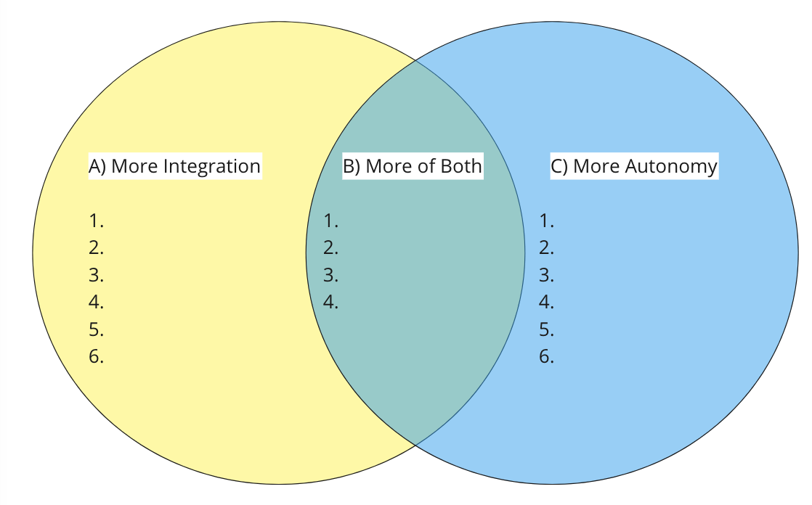

# Find Actions That Boost Both Integration and Autonomy.
{: .no_toc }

A simple experiment to help your team(s) move from either/or- to yes/and- thinking, and find solutions that address both sides of the coin.
{: .fs-6 .fw-300 }

## Table of contents
{: .no_toc .text-delta }

1. TOC
{:toc}

---

##  Find Actions That Boost Both Integration and Autonomy

Organisations with self-managing Scrum Teams face the difficult challenge balancing their autonomy while keeping their work integrated with the rest of the organisation. Because both of these aspects are equally desirable, and we can’t simply make an either-or decision, we are faced with what is called a “wicked question”.

Instead of letting the pendulum swing entirely to one side, this experiment is about finding ways of supporting both sides. With this approach, you help groups move from “either-or” to “yes-and” thinking. This experiment and its corresponding worksheet are based on the Liberating Structure Integrated~Autonomy.

## Steps

1. Invite people who have a stake in either increasing the autonomy of Scrum Teams or keeping them integrated with work done elsewhere. This includes the Scrum Teams themselves, departments they depend on (and vice versa), and management.

2. Begin by helping people make tensions between autonomy and integration tangible. Ask “For the Scrum Teams, where in their work is there tension between the desire for autonomy and the desire for integration?” Start with a minute of silent thinking **1 min**, then invite people to share their ideas in pairs **2 min**. Capture salient examples from the whole group **5 min**. For example, there can be tension between the autonomy that Scrum Teams have over their Sprint Backlog and the need to be able to pick up urgent issues from people outside the team that emerge during a Sprint. There can be tension between the autonomy of a Product Owner to order the Product Backlog and keeping that ordering aligned with corporate strategy. Or between allowing Scrum Teams to pick their own tools and having mandated tools that are safe for corporate environments.

3. The next step is to explore actions that promote integration. Forth is step, the participants work with the Integrated~Autonomy worksheet. It shows three columns with space for writing down ideas that lead to either more integration (A), more autonomy (C), or both (B). The group will focus on column A first. Ask “What actions boost integration of the Scrum Teams’ activities with what is happening elsewhere?” Start with a minute of silent thinking **1 min**, then invite people to share their ideas in groups of four **5 min**. Capture the most salient actions from the small groups on the left side of the worksheet **10 min**.

4. As a follow-up, explore actions that promote autonomy. Ask “What actions boost the autonomy of Scrum Teams?” Capture them in the right column of the worksheet. Start with a minute of silent thinking **1 min** , then invite people to share their ideas in groups of four **5 min**. Capture the most salient actions from the small groups on the right side of the worksheet **10 min**.

5. Now that you have actions that each address one side of the wicked question, help the group move into yes-and thinking. Ask “Which actions boost both integration and autonomy?” Capture them on the worksheet in the middle. Start with a minute of silent thinking **1 min**, then invite people to share their ideas in groups of four **5 min**. Capture the most salient actions from the small groups on the middle of the worksheet **10 min**.

6. Now that people have experience identifying actions that serve both sides, investigate earlier actions to see if they can be shifted to the middle. Ask “Which actions on the left or the right of the worksheet can be creatively modified to boost both integration and autonomy?” Start with a minute of silent thinking **1 min**, then invite people to share their ideas in groups of four **5 min**. Capture the most salient actions from the small groups on the middle of the worksheet **10 min**.

7. Order actions by their ability to promote both integration and autonomy and identify 15% Solutions for the most impactful ones.

## Insights

- Coming up with specific and tangible actions can be difficult. Keep asking “How would you do that for us?” or “What would that look like here?” in order to move groups beyond abstract ideas and platitudes (such as “more communication”).

- If you have a large group, you can make each group of four responsible for one of the actions you identified during step 2. Let them fill in the entire worksheet in their small group from the perspective of that action.

- You can replace the sides—integration and autonomy—with other wicked challenges. For example, there is also tension between responding to change as quickly as possible and preventing huge mistakes. Or the tension between standardisation on the one hand and customisation on the other. Work with whatever wicked challenge makes the most sense!

## Miro Template

[https://miro.com/app/board/o9J_lo4fAZQ=/?invite_link_id=340435553449](https://miro.com/app/board/o9J_lo4fAZQ=/?invite_link_id=340435553449)
