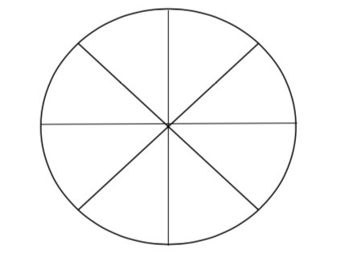

# Wheel of Anything
{: .no_toc }

The “wheel of anything” (or “wheel of life”, “wheel of work” etc) can be a valuable tool towards the start of a coaching programme, to explore what is happening in your client’s life (or in specific areas, such as work, leadership etc).
{: .fs-6 .fw-300 }

## Table of contents
{: .no_toc .text-delta }

1. TOC
{:toc}

---

## What is the tool?

- The sections in the wheel represent different parts and the aim is for them to be in balance.
- There can be any number of sections and the wheel may be about any subject; for example, life, work competencies, leadership styles, skills, coaching competencies, or any other area that could benefit with further examination.
- Your client owns the content of the wheel.

## How do you use it?

- Using the centre of the wheel as 0 and the outer edge as 10, rank the level of satisfaction with each area by drawing a curved line to form a new outer edge.
- However, you can be as creative as you like and use percentages, numbers or shading – whatever fits most comfortably with the client.
- As a coach remember to encourage goal-setting, planning and prioritisation and carry out ecology checks with the client – making a change in one area may adversely impact on another area & this needs discussion.
