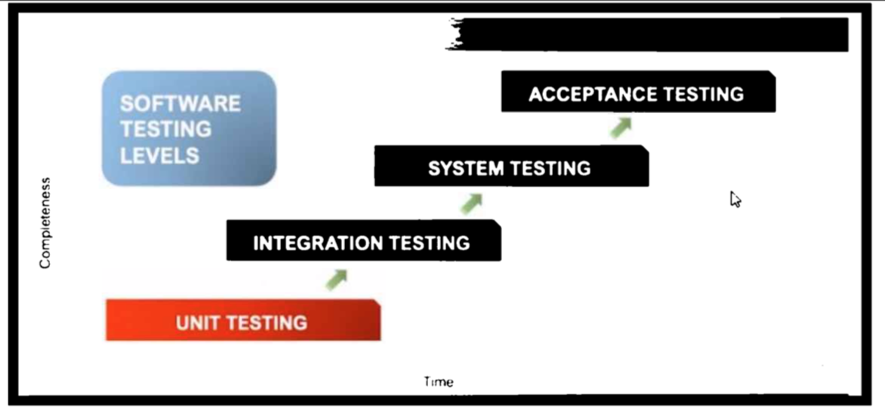
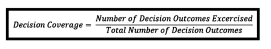
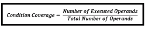

# Scrum Basics
{: .no_toc }

## Table of contents
{: .no_toc .text-delta }

1. TOC
{:toc}

## Part I: Definition, Team, Scrum Master, Product Owner, Developer

### Scrum Definition

- Scrum is a lightweight framework that helps people, teams and organisations generate value through adaptive solutions for complex problems.
- Scrum is simple. Try it as is and determine if its philosophy, theory, and structure help to achieve goals and create value.
- The Scrum framework is purposefully incomplete, only defining the parts required to implement Scrum theory.
- Scrum is built upon by the collective intelligence of the people using it.
- Rather than provide people with detailed instructions, the rules of Scrum guide their relationships and interactions.
- Various processes, techniques and methods can be employed within the framework.
- Scrum makes visible the relative efficacy of current management, environment, and work techniques, so that improvements can be made.
- Successful use of Scrum depends on people becoming more proficient in living five values: Commitment, Focus, Openness, Respect, and Courage.
- The decisions that are made, the steps taken, and the way Scrum is used should reinforce these values, not diminish or undermine them.
- How [maximising the value of the product resulting from the work of the Scrum Team] is done may vary widely across organisations, Scrum Teams, and individuals.
- Sprints are the heartbeat of Scrum, where ideas are turned into value.
- The Scrum framework, as outlined herein, is immutable. While implementing only parts of Scrum is possible, the result is not Scrum. Scrum exists only in its entirety and functions well as a container for other techniques, methodologies, and practices.

### Scrum Team

- [...] Scrum requires a Scrum Master to foster an environment where [...] the Scrum Team turns a selection of the work into an Increment of value during a Sprint.
A Scrum Team is expected to adapt the moment it learns anything new through inspection.
- The Scrum Team commits to achieving its goals and to supporting each other.
- Scrum Team members respect each other to be capable, independent people, and are respected as such by the people with whom they work.
- These values give direction to the Scrum Team with regard to their work, actions, and behaviour.
- The Scrum Team members learn and explore the values as they work with the Scrum events and artifacts.
- The fundamental unit of Scrum is a small team of people, a Scrum Team.
- The Scrum Team consists of one Scrum Master, one Product Owner, and Developers.
- Within a Scrum Team, there are no sub-teams or hierarchies.
- [The Scrum Team] is a cohesive unit of professionals focused on one objective at a time, the Product Goal.
- Scrum Teams are cross-functional, meaning the members have all the skills necessary to create value each Sprint.
- They are also self-managing, meaning they internally decide who does what, when, and how.
- The Scrum Team is small enough to remain nimble and large enough to complete significant work within a Sprint, typically 10 or fewer people.
- In general, we have found that smaller teams communicate better and are more productive.
- If Scrum Teams become too large, they should consider reorganising into multiple cohesive Scrum Teams, each focused on the same product.
- Therefore, [multiple cohesive Scrum Teams] should share the same Product Goal, Product Backlog, and Product Owner.
- The Scrum Team is responsible for all product-related activities from stakeholder collaboration, verification, maintenance, operation, experimentation, research and development, and anything else that might be required.
- They are structured and empowered by the organisation to manage their own work.
- Working in Sprints at a sustainable pace improves the Scrum Team’s focus and consistency.
- The entire Scrum Team is accountable for creating a valuable, useful Increment every Sprint.
- Scrum defines three specific accountabilities within the Scrum Team: the Developers, the Product Owner, and the Scrum Master.
The Product Owner is accountable for maximising the value of the product resulting from the work of the Scrum Team. How this is done may vary widely across organisations, Scrum Teams, and individuals.
- [Scrum Master] do this by helping everyone understand Scrum theory and practice, both within the Scrum Team and the organisation.
- Scrum Masters are true leaders who serve the Scrum Team and the larger organisation.
- The Scrum Master serves the Scrum Team in several ways, including coaching the team members in self-management and cross-functionality.
- The Scrum Master serves the Scrum Team in several ways, including helping the Scrum Team focus on creating high-value Increments that meet the Definition of Done.
- The Scrum Master serves the Scrum Team in several ways, including causing the removal of impediments to the Scrum Team’s progress.
- The Scrum Master serves the Scrum Team in several ways, including ensuring that all Scrum events take place and are positive, productive, and kept within the time-box.
- [Sprint Planning] This resulting plan is created by the collaborative work of the entire Scrum Team.
- [Sprint Planning: Why is this Sprint valuable?] The whole Scrum Team then collaborates to define a Sprint Goal that communicates why the Sprint is valuable to stakeholders.
- The Scrum Team presents the results of their work to key stakeholders and progress toward the Product Goal is discussed.
- During the event, the Scrum Team and stakeholders review what was accomplished in the Sprint and what has changed in their environment. Based on this information, attendees collaborate on what to do next.
- The Sprint Review is a working session and the Scrum Team should avoid limiting it to a presentation.
- The Scrum Team discusses what went well during the Sprint, what problems it encountered, and how those problems were (or were not) solved.
- These [Artifact] commitments exist to reinforce empiricism and the Scrum values for the Scrum Team and their stakeholders.
- [The Product Backlog] is the single source of work undertaken by the Scrum Team.
- Product Backlog items that can be Done by the Scrum Team within one Sprint are deemed ready for selection in a Sprint Planning event.
- The Product Goal describes a future state of the product which can serve as a target for the Scrum Team to plan against.
- The Product Goal is the long-term objective for the Scrum Team. They must fulfil (or abandon) one objective before taking on the next.
- The Sprint Goal also creates coherence and focus, encouraging the Scrum Team to work together rather than on separate initiatives.
- The Definition of Done creates transparency by providing everyone a shared understanding of what work was completed as part of the Increment.
- If the Definition of Done for an increment is part of the standards of the organisation, all Scrum Teams must follow it as a minimum.
- If it is not an organisational standard, the Scrum Team must create a Definition of Done appropriate for the product.
- If there are multiple Scrum Teams working together on a product, they must mutually define and comply with the same Definition of Done.

### Product Owner

- [...] Scrum requires a Scrum Master to foster an environment where [...] a Product Owner orders the work for a complex problem into a Product Backlog.
- The Scrum Team consists of one Scrum Master, one Product Owner, and Developers.
- Therefore, [multiple cohesive Scrum Teams] should share the same Product Goal, Product Backlog, and Product Owner.
- Scrum defines three specific accountabilities within the Scrum Team: the Developers, the Product Owner, and the Scrum Master.
- The Product Owner is accountable for maximising the value of the product resulting from the work of the Scrum Team. How this is done may vary widely across organisations, Scrum Teams, and individuals.
- The Product Owner is also accountable for effective Product Backlog management, which includes developing and explicitly communicating the Product Goal.
- The Product Owner is also accountable for effective Product Backlog management, which includes creating and clearly communicating Product Backlog items.
- The Product Owner is also accountable for effective Product Backlog management, which includes ordering Product Backlog items.
- The Product Owner is also accountable for effective Product Backlog management, which includes ensuring that the Product Backlog is transparent, visible and understood.
- The Product Owner may do the above work or may delegate the responsibility to others. Regardless, the Product Owner remains accountable.
- For Product Owners to succeed, the entire organisation must respect their decisions.
- [Product Owner] decisions are visible in the content and ordering of the Product Backlog, and through the inspectable Increment at the Sprint Review.
- The Product Owner is one person, not a committee.
The Product Owner may represent the needs of many stakeholders in the Product Backlog.
- Those wanting to change the Product Backlog can do so by trying to convince the Product Owner.
- The Scrum Master serves the Product Owner in several ways, including helping find techniques for effective Product Goal definition and Product Backlog management.
- The Scrum Master serves the Product Owner in several ways, including helping the Scrum Team understand the need for clear and concise Product Backlog items.
- The Scrum Master serves the Product Owner in several ways, including helping establish empirical product planning for a complex environment.
- The Scrum Master serves the Product Owner in several ways, including facilitating stakeholder collaboration as requested or needed.
- During the Sprint, scope may be clarified and renegotiated with the Product Owner as more is learned.
- Only the Product Owner has the authority to cancel the Sprint.
- The Product Owner ensures that attendees are prepared to discuss the most important Product Backlog items and how they map to the Product Goal.
- [Sprint Planning: What can be Done this Sprint?] Through discussion with the Product Owner, the Developers select items from the Product Backlog to include in the current Sprint.
- If the Product Owner or Scrum Master are actively working on items in the Sprint Backlog, they participate as Developers.
- The Product Owner may influence the Developers by helping them understand and select trade-offs.
- As the Developers work during the Sprint, they keep the Sprint Goal in mind. If the work turns out to be different than they expected, they collaborate with the Product Owner to negotiate the scope of the Sprint Backlog within the Sprint without affecting the Sprint Goal.

### Developers

- The Scrum Team consists of one Scrum Master, one Product Owner, and Developers.
- Scrum defines three specific accountabilities within the Scrum Team: the Developers, the Product Owner, and the Scrum Master.
- Developers are the people in the Scrum Team that are committed to creating any aspect of a usable Increment each Sprint.
- The specific skills needed by the Developers are often broad and will vary with the domain of work.
However, the Developers are always accountable for creating a plan for the Sprint, the Sprint Backlog.
- However, the Developers are always accountable for instilling quality by adhering to a Definition of Done.
- However, the Developers are always accountable for adapting their plan each day toward the Sprint Goal.
- However, the Developers are always accountable for holding each other accountable as professionals.
- [Sprint Planning: What can be Done this Sprint?] Through discussion with the Product Owner, the Developers select items from the Product Backlog to include in the current Sprint.
- [Sprint Planning: How will the chosen work get done?] For each selected Product Backlog item, the Developers plan the work necessary to create an Increment that meets the Definition of Done.
- [Sprint Planning: How will the chosen work get done?] How this is done is at the sole discretion of the Developers. No one else tells them how to turn Product Backlog items into Increments of value.
- The Daily Scrum is a 15-minute event for the Developers of the Scrum Team.
- If the Product Owner or Scrum Master are actively working on items in the Sprint Backlog, they participate as Developers.
- The Daily Scrum is not the only time Developers are allowed to adjust their plan.
- [Developers] often meet throughout the day for more detailed discussions about adapting or re-planning the rest of the Sprint’s work.
- The Developers who will be doing the work are responsible for the sizing.
- The Product Owner may influence the Developers by helping them understand and select trade-offs.
- The Sprint Backlog is a plan by and for the Developers.
- [The Sprint Backlog] is a highly visible, real-time picture of the work that the Developers plan to accomplish during the Sprint in order to achieve the Sprint Goal.
- Although the Sprint Goal is a commitment by the Developers, it provides flexibility in terms of the exact work needed to achieve it.
- As the Developers work during the Sprint, they keep the Sprint Goal in mind. If the work turns out to be different than they expected, they collaborate with the Product Owner to negotiate the scope of the Sprint Backlog within the Sprint without affecting the Sprint Goal.
- The Developers are required to conform to the Definition of Done.

### Scrum Master

- [...] Scrum requires a Scrum Master to foster an environment where [...] a Product Owner orders the work for a complex problem into a Product Backlog.
- [...] Scrum requires a Scrum Master to foster an environment where [...] the Scrum Team turns a selection of the work into an Increment of value during a Sprint.
- [...] Scrum requires a Scrum Master to foster an environment where [...] the Scrum Team and its stakeholders inspect the results and adjust for the next Sprint.
- The Scrum Team consists of one Scrum Master, one Product Owner, and Developers.
- Scrum defines three specific accountabilities within the Scrum Team: the Developers, the Product Owner, and the Scrum Master.
- The Scrum Master is accountable for establishing Scrum as defined in the Scrum Guide.
- [Scrum Master] do this by helping everyone understand Scrum theory and practice, both within the Scrum Team and the organisation.
- The Scrum Master is accountable for the Scrum Team’s effectiveness.
- [Scrum Masters] do this by enabling the Scrum Team to improve its practices, within the Scrum framework.
- Scrum Masters are true leaders who serve the Scrum Team and the larger organisation.
- The Scrum Master serves the Scrum Team in several ways, including coaching the team members in self-management and cross-functionality.
- The Scrum Master serves the Scrum Team in several ways, including helping the Scrum Team focus on creating high-value Increments that meet the Definition of Done.
- The Scrum Master serves the Scrum Team in several ways, including causing the removal of impediments to the Scrum Team’s progress.
- The Scrum Master serves the Scrum Team in several ways, including ensuring that all Scrum events take place and are positive, productive, and kept within the time-box.
- The Scrum Master serves the Product Owner in several ways, including helping find techniques for effective Product Goal definition and Product Backlog management.
- The Scrum Master serves the Product Owner in several ways, including helping the Scrum Team understand the need for clear and concise Product Backlog items.
- The Scrum Master serves the Product Owner in several ways, including helping establish empirical product planning for a complex environment.
- The Scrum Master serves the Product Owner in several ways, including facilitating stakeholder collaboration as requested or needed.
- The Scrum Master serves the organisation in several ways, including leading, training, and coaching the organisation in its Scrum adoption.
- The Scrum Master serves the organisation in several ways, including planning and advising Scrum implementations within the organisation.
- The Scrum Master serves the organisation in several ways, including helping employees and stakeholders understand and enact an empirical approach for complex work.
- The Scrum Master serves the organisation in several ways, including removing barriers between stakeholders and Scrum Teams.
- If the Product Owner or Scrum Master are actively working on items in the Sprint Backlog, they participate as Developers.

---

## Part II: Events

### Events in General

- Scrum combines four formal events for inspection and adaptation within a containing event, the Sprint.
- These events work because they implement the empirical Scrum pillars of transparency, inspection, and adaptation.
- To help with inspection, Scrum provides cadence in the form of its five events.
- The Scrum Team members learn and explore the values as they work with the Scrum events and artifacts.
- The Scrum Master serves the Scrum Team in several ways, including ensuring that all Scrum events take place and are positive, productive, and kept within the time-box.
- The Sprint is a container for all other events.
- Each event in Scrum is a formal opportunity to inspect and adapt Scrum artifacts.
- [Scrum] events are specifically designed to enable the transparency required.
- Failure to operate any events as prescribed results in lost opportunities to inspect and adapt.
- Events are used in Scrum to create regularity and to minimise the need for meetings not defined in Scrum.
- Optimally, all events are held at the same time and place to reduce complexity.

### Sprint

- [...] Scrum requires a Scrum Master to foster an environment where [...] the Scrum Team turns a selection of the work into an Increment of value during a Sprint.
- Scrum combines four formal events for inspection and adaptation within a containing event, the Sprint.
- Working in Sprints at a sustainable pace improves the Scrum Team’s focus and consistency.
- The entire Scrum Team is accountable for creating a valuable, useful Increment every Sprint.
- The Sprint is a container for all other events.
- Sprints are the heartbeat of Scrum, where ideas are turned into value.
- [Sprints] are fixed length events of one month or less to create consistency. 7 A new Sprint starts immediately after the conclusion of the previous Sprint.
- All the work necessary to achieve the Product Goal, including Sprint Planning, Daily Scrums, Sprint Review, and Sprint Retrospective, happen within Sprints.
- During the Sprint, no changes are made that would endanger the Sprint Goal.
- During the Sprint, quality does not decrease.
- During the Sprint, the Product Backlog is refined as needed.
- During the Sprint, scope may be clarified and renegotiated with the Product Owner as more is learned.
- Sprints enable predictability by ensuring inspection and adaptation of progress toward a Product Goal at least every calendar month
- When a Sprint’s horizon is too long the Sprint Goal may become invalid, complexity may rise, and risk may increase.
- Shorter Sprints can be employed to generate more learning cycles and limit risk of cost and effort to a smaller time frame.
- Each Sprint may be considered a short project.
- Various practices exist to forecast progress, like burn-downs, burn-ups, or cumulative flows. While proven useful, these do not replace the importance of empiricism.
- In complex environments, what will happen is unknown. Only what has already happened may be used for forward-looking decision making.
- A Sprint could be cancelled if the Sprint Goal becomes obsolete.
- Only the Product Owner has the authority to cancel the Sprint.
- Sprint Planning initiates the Sprint by laying out the work to be performed for the Sprint.
- To reduce complexity, [the Daily Scrum] is held at the same time and place every working day of the Sprint.
- The Sprint Review is the second to last event of the Sprint and is time-boxed to a maximum of four hours for a one-month Sprint. For shorter Sprints, the event is usually shorter.
- The Scrum Team inspects how the last Sprint went with regards to individuals, interactions, processes, tools, and their Definition of Done.
- The Scrum Team discusses what went well during the Sprint, what problems it encountered, and how those problems were (or were not) solved.
- The most impactful improvements are addressed as soon as possible. They may even be added to the Sprint Backlog for the next Sprint.
- The Sprint Retrospective concludes the Sprint.
- Product Backlog items that can be Done by the Scrum Team within one Sprint are deemed ready for selection in a Sprint Planning event.
- The Sprint Backlog is composed of the Sprint Goal (why), the set of Product Backlog items selected for the Sprint (what), as well as an actionable plan for delivering the Increment (how).
- [The Sprint Backlog] is a highly visible, real-time picture of the work that the Developers plan to accomplish during the Sprint in order to achieve the Sprint Goal.
- The Sprint Goal is the single objective for the Sprint.
- As the Developers work during the Sprint, they keep the Sprint Goal in mind. If the work turns out to be different than they expected, they collaborate with the Product Owner to negotiate the scope of the Sprint Backlog within the Sprint without affecting the Sprint Goal.
- Multiple Increments may be created within a Sprint.
- However, an Increment may be delivered to stakeholders prior to the end of the Sprint.

### Sprint Planning

- Sprint Planning initiates the Sprint by laying out the work to be performed for the Sprint.
- This resulting plan is created by the collaborative work of the entire Scrum Team.
- The Product Owner ensures that attendees are prepared to discuss the most important Product Backlog items and how they map to the Product Goal.
- The Scrum Team may also invite other people to attend Sprint Planning to provide advice.
- [Sprint Planning: Why is this Sprint valuable?] The Product Owner proposes how the product could increase its value and utility in the current Sprint.
- [Sprint Planning: Why is this Sprint valuable?] The whole Scrum Team then collaborates to define a Sprint Goal that communicates why the Sprint is valuable to stakeholders.
- [Sprint Planning: Why is this Sprint valuable?] The Sprint Goal must be finalised prior to the end of Sprint Planning.
- [Sprint Planning: What can be Done this Sprint?] Through discussion with the Product Owner, the Developers select items from the Product Backlog to include in the current Sprint.
- [Sprint Planning: What can be Done this Sprint?] The Scrum Team may refine these items during this process, which increases understanding and confidence.
- [Sprint Planning: What can be Done this Sprint?] Selecting how much can be completed within a Sprint may be challenging. However, the more the Developers know about their past performance, their upcoming capacity, and their Definition of Done, the more confident they will be in their Sprint forecasts.
- [Sprint Planning: How will the chosen work get done?] For each selected Product Backlog item, the Developers plan the work necessary to create an Increment that meets the Definition of Done.
- [Sprint Planning: How will the chosen work get done?] This is often done by decomposing Product Backlog items into smaller work items of one day or less.
- [Sprint Planning: How will the chosen work get done?] How this is done is at the sole discretion of the Developers. No one else tells them how to turn Product Backlog items into Increments of value.
- The Sprint Goal, the Product Backlog items selected for the Sprint, plus the plan for delivering them are together referred to as the Sprint Backlog.
- Sprint Planning is time-boxed to a maximum of eight hours for a one-month Sprint. For shorter Sprints, the event is usually shorter.
-- Product Backlog items that can be Done by the Scrum Team within one Sprint are deemed ready for selection in a Sprint Planning event.
-- The Sprint Goal is created during the Sprint Planning event and then added to the Sprint Backlog.

### Daily Scrum

- The purpose of the Daily Scrum is to inspect progress toward the Sprint Goal and adapt the Sprint Backlog as necessary, adjusting the upcoming planned work.
- The Daily Scrum is a 15-minute event for the Developers of the Scrum Team.
- To reduce complexity, [the Daily Scrum] is held at the same time and place every working day of the Sprint.
- If the Product Owner or Scrum Master are actively working on items in the Sprint Backlog, they participate as Developers.
- The Developers can select whatever structure and techniques they want, as long as their Daily Scrum focuses on progress toward the Sprint Goal and produces an actionable plan for the next day of work. This creates focus and improves self- management.
- Daily Scrums improve communications, identify impediments, promote quick decision-making, and consequently eliminate the need for other meetings.
- The Daily Scrum is not the only time Developers are allowed to adjust their plan.
- [Developers] often meet throughout the day for more detailed discussions about adapting or re-planning the rest of the Sprint’s work.
- [The Sprint Backlog] should have enough detail that they can inspect their progress in the Daily Scrum.

### Sprint Review

- [Product Owner] decisions are visible in the content and ordering of the Product Backlog, and through the inspectable Increment at the Sprint Review.
- The purpose of the Sprint Review is to inspect the outcome of the Sprint and determine future adaptations.
- The Scrum Team presents the results of their work to key stakeholders and progress toward the Product Goal is discussed.
- During the event, the Scrum Team and stakeholders review what was accomplished in the Sprint and what has changed in their environment. Based on this information, attendees collaborate on what to do next.
- The Product Backlog may also be adjusted to meet new opportunities.
- The Sprint Review is a working session and the Scrum Team should avoid limiting it to a presentation.
- The Sprint Review is the second to last event of the Sprint and is time-boxed to a maximum of four hours for a one-month Sprint. For shorter Sprints, the event is usually shorter.
- The sum of the Increments is presented at the Sprint Review thus supporting empiricism.
- The Sprint Review should never be considered a gate to releasing value.
- If a Product Backlog item does not meet the Definition of Done, it cannot be released or even presented at the Sprint Review.

### Sprint Retrospective

- However, the Developers are always accountable for holding each other accountable as professionals.
- The purpose of the Sprint Retrospective is to plan ways to increase quality and effectiveness.
- The Scrum Team inspects how the last Sprint went with regards to individuals, interactions, processes, tools, and their Definition of Done.
- [During the Sprint Retrospective,] assumptions that led [inspected elements] astray are identified and their origins explored.
- The Scrum Team discusses what went well during the Sprint, what problems it encountered, and how those problems were (or were not) solved.
- The Scrum Team identifies the most helpful changes to improve its effectiveness.
- The most impactful improvements are addressed as soon as possible. They may even be added to the Sprint Backlog for the next Sprint.
- The Sprint Retrospective concludes the Sprint.
- [The Sprint Retrospective] is time-boxed to a maximum of three hours for a one- month Sprint. For shorter Sprints, the event is usually shorter-

## Part III: Artifacts

### Artifacts in General

- With Scrum, important decisions are based on the perceived state of its three formal artifacts. Artifacts that have low transparency can lead to decisions that diminish value and increase risk.
- The Scrum artifacts and the progress toward agreed goals must be inspected frequently and diligently to detect potentially undesirable variances or problems.
- The Scrum Team members learn and explore the values as they work with the Scrum events and artifacts.
- Each event in Scrum is a formal opportunity to inspect and adapt Scrum artifacts.
- Scrum’s artifacts represent work or value.
- [Artifacts] are designed to maximise transparency of key information. Thus, everyone inspecting them has the same basis for adaptation.
- Each artifact contains a commitment to ensure it provides information that enhances transparency and focus against which progress can be measured.
- [Artifact commitment:] For the Product Backlog it is the Product Goal.
- [Artifact commitment:] For the Sprint Backlog it is the Sprint Goal.
- [Artifact commitment:] For the Increment it is the Definition of Done.
- These [Artifact] commitments exist to reinforce empiricism and the Scrum values for the Scrum Team and their stakeholders.

### Product Backlog

- [...] Scrum requires a Scrum Master to foster an environment where [...] a Product Owner orders the work for a complex problem into a Product Backlog.
- Therefore, [multiple cohesive Scrum Teams] should share the same Product Goal, Product Backlog, and Product Owner.
- The Product Owner is also accountable for effective Product Backlog management, which includes developing and explicitly communicating the Product Goal.
- The Product Owner is also accountable for effective Product Backlog management, which includes creating and clearly communicating Product Backlog items.
- The Product Owner is also accountable for effective Product Backlog management, which includes ordering Product Backlog items.
- The Product Owner is also accountable for effective Product Backlog management, which includes ensuring that the Product Backlog is transparent, visible and understood.
- [Product Owner] decisions are visible in the content and ordering of the Product Backlog, and through the inspectable Increment at the Sprint Review.
- The Scrum Master serves the Product Owner in several ways, including helping find techniques for effective Product Goal definition and Product Backlog management.
- [Sprint Planning: What can be Done this Sprint?] Through discussion with the Product Owner, the Developers select items from the Product Backlog to include in the current Sprint.
- The Product Backlog may also be adjusted to meet new opportunities.
- [Artifact commitment:] For the Product Backlog it is the Product Goal.
- The Product Backlog is an emergent, ordered list of what is needed to improve the product.
- [The Product Backlog] is the single source of work undertaken by the Scrum Team.
- Product Backlog items that can be Done by the Scrum Team within one Sprint are deemed ready for selection in a Sprint Planning event.
- [Product Backlog items] usually acquire this degree of transparency after refining activities. Product Backlog refinement is the act of breaking down and further defining Product Backlog items into smaller more precise items.
- [Product Backlog refinement] is an ongoing activity to add details, such as a description, order, and size. Attributes often vary with the domain of work.
- The Developers who will be doing the work are responsible for the sizing.
- The Product Owner may influence the Developers by helping them understand and select trade-offs.
- The Product Goal is in the Product Backlog. The rest of the Product Backlog emerges to define “what” will fulfil the Product Goal.
- Instead, [an undone Product Backlog item] returns to the Product Backlog for future consideration.

### Product Backlog Refinement

- The Scrum Master serves the Product Owner in several ways, including helping find techniques for effective Product Goal definition and Product Backlog management.
- During the Sprint, the Product Backlog is refined as needed.
- [Sprint Planning: What can be Done this Sprint?] The Scrum Team may refine these items during this process, which increases understanding and confidence.
- [Product Backlog items] usually acquire this degree of transparency after refining activities. Product Backlog refinement is the act of breaking down and further defining Product Backlog items into smaller more precise items.
- [Product Backlog refinement] is an ongoing activity to add details, such as a description, order, and size. Attributes often vary with the domain of work.

### Product Backlog Item

- The Product Owner is also accountable for effective Product Backlog management, which includes creating and clearly communicating Product Backlog items.
- The Product Owner is also accountable for effective Product Backlog management, which includes ordering Product Backlog items.
- The Scrum Master serves the Product Owner in several ways, including helping the Scrum Team understand the need for clear and concise Product Backlog items.
- The Product Owner ensures that attendees are prepared to discuss the most important Product Backlog items and how they map to the Product Goal.
- [Sprint Planning: How will the chosen work get done?] For each selected Product Backlog item, the Developers plan the work necessary to create an Increment that meets the Definition of Done.
- [Sprint Planning: How will the chosen work get done?] This is often done by decomposing Product Backlog items into smaller work items of one day or less.
- [Sprint Planning: How will the chosen work get done?] How this is done is at the sole discretion of the Developers. No one else tells them how to turn Product Backlog items into Increments of value.
- The Sprint Goal, the Product Backlog items selected for the Sprint, plus the plan for delivering them are together referred to as the Sprint Backlog.
- Product Backlog items that can be Done by the Scrum Team within one Sprint are deemed ready for selection in a Sprint Planning event.
- [Product Backlog items] usually acquire this degree of transparency after refining activities. Product Backlog refinement is the act of breaking down and further defining Product Backlog items into smaller more precise items.
- The Sprint Backlog is composed of the Sprint Goal (why), the set of Product Backlog items selected for the Sprint (what), as well as an actionable plan for delivering the Increment (how).
- If a Product Backlog item does not meet the Definition of Done, it cannot be released or even presented at the Sprint Review.

### Product Goal

- The Scrum artifacts and the progress toward agreed goals must be inspected frequently and diligently to detect potentially undesirable variances or problems.
- The Scrum Team commits to achieving its goals and to supporting each other.
- Their primary focus is on the work of the Sprint to make the best possible progress toward these goals.
- [The Scrum Team] is a cohesive unit of professionals focused on one objective at a time, the Product Goal.
- Therefore, [multiple cohesive Scrum Teams] should share the same Product Goal, Product Backlog, and Product Owner.
- The Product Owner is also accountable for effective Product Backlog management, which includes developing and explicitly communicating the Product Goal.
- The Scrum Master serves the Product Owner in several ways, including helping find techniques for effective Product Goal definition and Product Backlog management.
- Sprints enable predictability by ensuring inspection and adaptation of progress toward a Product Goal at least every calendar month
- The Product Owner ensures that attendees are prepared to discuss the most important Product Backlog items and how they map to the Product Goal."
- The Scrum Team presents the results of their work to key stakeholders and progress toward the Product Goal is discussed.
- The Product Backlog may also be adjusted to meet new opportunities.
- [Artifact commitment:] For the Product Backlog it is the Product Goal.
- The Product Goal describes a future state of the product which can serve as a target for the Scrum Team to plan against.
- The Product Goal is in the Product Backlog. The rest of the Product Backlog emerges to define “what” will fulfil the Product Goal.
- [Definition] A product is a vehicle to deliver value. It has a clear boundary, known stakeholders, well-defined users or customers. A product could be a service, a physical product, or something more abstract
- The Product Goal is the long-term objective for the Scrum Team. They must fulfil (or abandon) one objective before taking on the next.
- An Increment is a concrete stepping stone toward the Product Goal.

### Sprint Backlog

- However, the Developers are always accountable for creating a plan for the Sprint, the Sprint Backlog.
- [Sprint Planning: What can be Done this Sprint?] Through discussion with the Product Owner, the Developers select items from the Product Backlog to include in the current Sprint.
- [Sprint Planning: What can be Done this Sprint?] Selecting how much can be completed within a Sprint may be challenging. However, the more the Developers know about their past performance, their upcoming capacity, and their Definition of Done, the more confident they will be in their Sprint forecasts.
- The Sprint Goal, the Product Backlog items selected for the Sprint, plus the plan for delivering them are together referred to as the Sprint Backlog.
- The purpose of the Daily Scrum is to inspect progress toward the Sprint Goal and adapt the Sprint Backlog as necessary, adjusting the upcoming planned work.
- If the Product Owner or Scrum Master are actively working on items in the Sprint Backlog, they participate as Developers.
- The most impactful improvements are addressed as soon as possible. They may even be added to the Sprint Backlog for the next Sprint.
- [Artifact commitment:] For the Sprint Backlog it is the Sprint Goal.
- The Sprint Backlog is composed of the Sprint Goal (why), the set of Product Backlog items selected for the Sprint (what), as well as an actionable plan for delivering the Increment (how).
- The Sprint Backlog is a plan by and for the Developers.
- [The Sprint Backlog] is a highly visible, real-time picture of the work that the Developers plan to accomplish during the Sprint in order to achieve the Sprint Goal.
- Consequently, the Sprint Backlog is updated throughout the Sprint as more is learned.
- [The Sprint Backlog] should have enough detail that they can inspect their progress in the Daily Scrum.
- The Sprint Goal is created during the Sprint Planning event and then added to the Sprint Backlog.
- As the Developers work during the Sprint, they keep the Sprint Goal in mind. If the work turns out to be different than they expected, they collaborate with the Product Owner to negotiate the scope of the Sprint Backlog within the Sprint without affecting the Sprint Goal.

### Sprint Goal

- The Scrum artifacts and the progress toward agreed goals must be inspected frequently and diligently to detect potentially undesirable variances or problems.
- The Scrum Team commits to achieving its goals and to supporting each other.
- Their primary focus is on the work of the Sprint to make the best possible progress toward these goals.
- However, the Developers are always accountable for adapting their plan each day toward the Sprint Goal.
- During the Sprint, no changes are made that would endanger the Sprint Goal.
- During the Sprint, scope may be clarified and renegotiated with the Product Owner as more is learned.
- When a Sprint’s horizon is too long the Sprint Goal may become invalid, complexity may rise, and risk may increase.
- A Sprint could be cancelled if the Sprint Goal becomes obsolete.
- [Sprint Planning: Why is this Sprint valuable?] The whole Scrum Team then collaborates to define a Sprint Goal that communicates why the Sprint is valuable to stakeholders.
- [Sprint Planning: Why is this Sprint valuable?] The Sprint Goal must be finalised prior to the end of Sprint Planning.
- The Sprint Goal, the Product Backlog items selected for the Sprint, plus the plan for delivering them are together referred to as the Sprint Backlog.
- The purpose of the Daily Scrum is to inspect progress toward the Sprint Goal and adapt the Sprint Backlog as necessary, adjusting the upcoming planned work.
- The Developers can select whatever structure and techniques they want, as long as their Daily Scrum focuses on progress toward the Sprint Goal and produces an actionable plan for the next day of work. This creates focus and improves self- management.
- [Artifact commitment:] For the Sprint Backlog it is the Sprint Goal.
- The Sprint Backlog is composed of the Sprint Goal (why), the set of Product Backlog items selected for the Sprint (what), as well as an actionable plan for delivering the Increment (how).
- [The Sprint Backlog] is a highly visible, real-time picture of the work that the Developers plan to accomplish during the Sprint in order to achieve the Sprint Goal.
- The Sprint Goal is the single objective for the Sprint.
- Although the Sprint Goal is a commitment by the Developers, it provides flexibility in terms of the exact work needed to achieve it.
- The Sprint Goal also creates coherence and focus, encouraging the Scrum Team to work together rather than on separate initiatives.
- The Sprint Goal is created during the Sprint Planning event and then added to the Sprint Backlog.
- As the Developers work during the Sprint, they keep the Sprint Goal in mind. If the work turns out to be different than they expected, they collaborate with the Product Owner to negotiate the scope of the Sprint Backlog within the Sprint without affecting the Sprint Goal.

## Product Increment

- [...] Scrum requires a Scrum Master to foster an environment where [...] the Scrum Team turns a selection of the work into an Increment of value during a Sprint.
- The entire Scrum Team is accountable for creating a valuable, useful Increment every Sprint.
- [Product Owner] decisions are visible in the content and ordering of the Product Backlog, and through the inspectable Increment at the Sprint Review.
- The Scrum Master serves the Scrum Team in several ways, including helping the Scrum Team focus on creating high-value Increments that meet the Definition of Done.
- [Sprint Planning: How will the chosen work get done?] For each selected Product Backlog item, the Developers plan the work necessary to create an Increment that meets the Definition of Done.
- [Sprint Planning: How will the chosen work get done?] How this is done is at the sole discretion of the Developers. No one else tells them how to turn Product Backlog items into Increments of value.
- The purpose of the Sprint Review is to inspect the outcome of the Sprint and determine future adaptations.
- The Scrum Team presents the results of their work to key stakeholders and progress toward the Product Goal is discussed.
- During the event, the Scrum Team and stakeholders review what was accomplished in the Sprint and what has changed in their environment. Based on this information, attendees collaborate on what to do next.
- [Artifact commitment:] For the Increment it is the Definition of Done.
- The Sprint Backlog is composed of the Sprint Goal (why), the set of Product Backlog items selected for the Sprint (what), as well as an actionable plan for delivering the Increment (how).
- An Increment is a concrete stepping stone toward the Product Goal.
- Each Increment is additive to all prior Increments and thoroughly verified, ensuring that all Increments work together.
- In order to provide value, the Increment must be usable.
- Multiple Increments may be created within a Sprint.
- The sum of the Increments is presented at the Sprint Review thus supporting empiricism.
- However, an Increment may be delivered to stakeholders prior to the end of the Sprint.
- The Sprint Review should never be considered a gate to releasing value.
- Work cannot be considered part of an Increment unless it meets the Definition of Done.
- The Definition of Done is a formal description of the state of the Increment when it meets the quality measures required for the product.
- The moment a Product Backlog item meets the Definition of Done, an Increment is born.
- The Definition of Done creates transparency by providing everyone a shared understanding of what work was completed as part of the Increment.
- If the Definition of Done for an increment is part of the standards of the organisation, all Scrum Teams must follow it as a minimum.

### Definition of Done

- However, the Developers are always accountable for instilling quality by adhering to a Definition of Done.
- The Scrum Master serves the Scrum Team in several ways, including helping the Scrum Team focus on creating high-value Increments that meet the Definition of Done.
- During the Sprint, quality does not decrease.
- [Sprint Planning: What can be Done this Sprint?] Selecting how much can be completed within a Sprint may be challenging. However, the more the Developers know about their past performance, their upcoming capacity, and their Definition of Done, the more confident they will be in their Sprint forecasts.
- [Sprint Planning: How will the chosen work get done?] For each selected Product Backlog item, the Developers plan the work necessary to create an Increment that meets the Definition of Done.
- The Scrum Team inspects how the last Sprint went with regards to individuals, interactions, processes, tools, and their Definition of Done.
- [Artifact commitment:] For the Increment it is the Definition of Done.
- Product Backlog items that can be Done by the Scrum Team within one Sprint are deemed ready for selection in a Sprint Planning event.
- Work cannot be considered part of an Increment unless it meets the Definition of Done.
- The Definition of Done is a formal description of the state of the Increment when it meets the quality measures required for the product.
- The moment a Product Backlog item meets the Definition of Done, an Increment is born.
- The Definition of Done creates transparency by providing everyone a shared understanding of what work was completed as part of the Increment.
- If a Product Backlog item does not meet the Definition of Done, it cannot be released or even presented at the Sprint Review.
- Instead, [an undone Product Backlog item] returns to the Product Backlog for future consideration.
- If the Definition of Done for an increment is part of the standards of the organisation, all Scrum Teams must follow it as a minimum.
- If it is not an organisational standard, the Scrum Team must create a Definition of Done appropriate for the product.
- The Developers are required to conform to the Definition of Done.
- If there are multiple Scrum Teams working together on a product, they must mutually define and comply with the same Definition of Done.

## Part IV: Other Key Elements

### Accountability, Responsibility

- The entire Scrum Team is accountable for creating a valuable, useful Increment every Sprint.
- Scrum defines three specific accountabilities within the Scrum Team: the Developers, the Product Owner, and the Scrum Master.
- However, the Developers are always accountable for creating a plan for the Sprint, the Sprint Backlog.
- However, the Developers are always accountable for instilling quality by adhering to a Definition of Done.
- However, the Developers are always accountable for adapting their plan each day toward the Sprint Goal.
- However, the Developers are always accountable for holding each other accountable as professionals.
- The Product Owner is accountable for maximising the value of the product resulting from the work of the Scrum Team. How this is done may vary widely across organisations, Scrum Teams, and individuals.
- The Product Owner is also accountable for effective Product Backlog management, which includes developing and explicitly communicating the Product Goal.
- The Product Owner is also accountable for effective Product Backlog management, which includes creating and clearly communicating Product Backlog items.
- The Product Owner is also accountable for effective Product Backlog management, which includes ordering Product Backlog items.
- The Product Owner is also accountable for effective Product Backlog management, which includes ensuring that the Product Backlog is transparent, visible and understood.
- The Product Owner may do the above work or may delegate the responsibility to others. Regardless, the Product Owner remains accountable.
- The Scrum Master is accountable for establishing Scrum as defined in the Scrum Guide.
- The Scrum Master is accountable for the Scrum Team’s effectiveness.

### Adaptation

- Scrum combines four formal events for inspection and adaptation within a containing event, the Sprint.
- These events work because they implement the empirical Scrum pillars of transparency, inspection, and adaptation.
- Inspection enables adaptation. Inspection without adaptation is considered pointless.
- If any aspects of a process deviate outside acceptable limits or if the resulting product is unacceptable, the process being applied or the materials being produced must be adjusted.
- The adjustment must be made as soon as possible to minimise further deviation.
- Adaptation becomes more difficult when the people involved are not empowered or self-managing.
- A Scrum Team is expected to adapt the moment it learns anything new through inspection.
- When these values are embodied by the Scrum Team and the people they work with, the empirical Scrum pillars of transparency, inspection, and adaptation come to life building trust.
- However, the Developers are always accountable for adapting their plan each day toward the Sprint Goal.
- Each event in Scrum is a formal opportunity to inspect and adapt Scrum artifacts.
- Failure to operate any events as prescribed results in lost opportunities to inspect and adapt.
- Sprints enable predictability by ensuring inspection and adaptation of progress toward a Product Goal at least every calendar month
- The purpose of the Daily Scrum is to inspect progress toward the Sprint Goal and adapt the Sprint Backlog as necessary, adjusting the upcoming planned work.
- The purpose of the Sprint Review is to inspect the outcome of the Sprint and determine future adaptations.
- The Product Backlog may also be adjusted to meet new opportunities.
- The most impactful improvements are addressed as soon as possible. They may even be added to the Sprint Backlog for the next Sprint.
- [Artifacts] are designed to maximise transparency of key information. Thus, everyone inspecting them has the same basis for adaptation.

### Capacity

- [Sprint Planning: What can be Done this Sprint?] Selecting how much can be completed within a Sprint may be challenging. However, the more the Developers know about their past performance, their upcoming capacity, and their Definition of Done, the more confident they will be in their Sprint forecasts.

### Change

- Scrum events are designed to provoke change.
- The adjustment must be made as soon as possible to minimise further deviation. 7 During the Sprint, no changes are made that would endanger the Sprint Goal.
- The Scrum Team identifies the most helpful changes to improve its effectiveness.

### Coaching, Consulting

- The Scrum Master serves the Scrum Team in several ways, including coaching the team members in self-management and cross-functionality.
- The Scrum Master serves the organisation in several ways, including leading, training, and coaching the organisation in its Scrum adoption.
- The Scrum Master serves the organisation in several ways, including planning and advising Scrum implementations within the organisation.
- The Scrum Team may also invite other people to attend Sprint Planning to provide advice.

### Collaboration

- Scrum is built upon by the collective intelligence of the people using it.
- Rather than provide people with detailed instructions, the rules of Scrum guide their relationships and interactions.
- Scrum engages groups of people who collectively have all the skills and expertise to do the work and share or acquire such skills as needed.
- Scrum Team members respect each other to be capable, independent people, and are respected as such by the people with whom they work.
- The Product Owner may do the above work or may delegate the responsibility to others. Regardless, the Product Owner remains accountable.
- For Product Owners to succeed, the entire organisation must respect their decisions.
- Those wanting to change the Product Backlog can do so by trying to convince the Product Owner.
- The Scrum Master serves the Product Owner in several ways, including facilitating stakeholder collaboration as requested or needed.
- The Scrum Master serves the organisation in several ways, including removing barriers between stakeholders and Scrum Teams.
- This resulting plan is created by the collaborative work of the entire Scrum Team.
- [Sprint Planning: Why is this Sprint valuable?] The whole Scrum Team then collaborates to define a Sprint Goal that communicates why the Sprint is valuable to stakeholders.
- During the event, the Scrum Team and stakeholders review what was accomplished in the Sprint and what has changed in their environment. Based on this information, attendees collaborate on what to do next.
- The Sprint Review is a working session and the Scrum Team should avoid limiting it to a presentation.
- The Scrum Team inspects how the last Sprint went with regards to individuals, interactions, processes, tools, and their Definition of Done.
- The Sprint Goal also creates coherence and focus, encouraging the Scrum Team to work together rather than on separate initiatives.
- As the Developers work during the Sprint, they keep the Sprint Goal in mind. If the work turns out to be different than they expected, they collaborate with the Product Owner to negotiate the scope of the Sprint Backlog within the Sprint without affecting the Sprint Goal.

### Commitment

- Successful use of Scrum depends on people becoming more proficient in living five values: Commitment, Focus, Openness, Respect, and Courage.
- The Scrum Team commits to achieving its goals and to supporting each other.
- Developers are the people in the Scrum Team that are committed to creating any aspect of a usable Increment each Sprint.
- Each artifact contains a commitment to ensure it provides information that enhances transparency and focus against which progress can be measured.
- [Artifact commitment:] For the Product Backlog it is the Product Goal.
- [Artifact commitment:] For the Sprint Backlog it is the Sprint Goal.
- [Artifact commitment:] For the Increment it is the Definition of Done.
- Although the Sprint Goal is a commitment by the Developers, it provides flexibility in terms of the exact work needed to achieve it.

Commitment is about **dedication** and applies to the actions, the effort, not the final result. Scrum Teams should:
- Commit to the team.
- Commit to quality.
- Commit to collaborate.
- Commit to learn.
- Commit to do the best we can, every day again.
- Commit to the Sprint Goal.
- Commit to be professional.
- Commit to self-organise.
- Commit to excellence.
- Commit to the agile principles.
- Commit to create working software.
- Commit to look for improvements.
- Commit to the Definition of Done.
- Commit to the Scrum framework.
- Commit to focus on Value.
- Commit to finish work.
- Commit to inspect & adapt.
- Commit to transparency.
- Commit to challenge the status-quo.

### Communication

- In general, we have found that smaller teams communicate better and are more productive.
- The Product Owner is also accountable for effective Product Backlog management, which includes developing and explicitly communicating the Product Goal.
- The Product Owner is also accountable for effective Product Backlog management, which includes creating and clearly communicating Product Backlog items.
- The Product Owner is also accountable for effective Product Backlog management, which includes ensuring that the Product Backlog is transparent, visible and understood.
- [Sprint Planning: Why is this Sprint valuable?] The whole Scrum Team then collaborates to define a Sprint Goal that communicates why the Sprint is valuable to stakeholders.
- Daily Scrums improve communications, identify impediments, promote quick decision-making, and consequently eliminate the need for other meetings.
- The Scrum Team inspects how the last Sprint went with regards to individuals, interactions, processes, tools, and their Definition of Done.

### Complexity

- [...] Scrum requires a Scrum Master to foster an environment where [...] a Product Owner orders the work for a complex problem into a Product Backlog.
- The Scrum Master serves the Product Owner in several ways, including helping establish empirical product planning for a complex environment.
- The Scrum Master serves the organisation in several ways, including helping employees and stakeholders understand and enact an empirical approach for complex work.
- Optimally, all events are held at the same time and place to reduce complexity.
- When a Sprint’s horizon is too long the Sprint Goal may become invalid, complexity may rise, and risk may increase.
- In complex environments, what will happen is unknown. Only what has already happened may be used for forward-looking decision making.
- To reduce complexity, [the Daily Scrum] is held at the same time and place every working day of the Sprint.

### Continuous Improvement

- The Scrum Master is accountable for the Scrum Team’s effectiveness.
- [Scrum Masters] do this by enabling the Scrum Team to improve its practices, within the Scrum framework.
- The purpose of the Sprint Retrospective is to plan ways to increase quality and effectiveness.
- The Scrum Team inspects how the last Sprint went with regards to individuals, interactions, processes, tools, and their Definition of Done.

### Courage

- The Scrum Team members should have the courage to do the right things and work on tough problems. This includes:
- Courage in not building stuff that nobody wants.
- Courage in admitting requirements will never be perfect and that no plan can capture reality and complexity.
- Courage to consider change as a source of inspiration and innovation.
- Courage to not deliver undone software.
- Courage in sharing all possible information (transparency) that might help the team and the organisation.
- Courage in admitting that nobody is perfect. Courage to change direction.
- Courage to share risks and benefits.
- Courage to promote Scrum and empiricism to deal with complexity.
- Courage to let go of the feint certainties of the past.
- Courage to support the Scrum Values.

### Cross-Functionality

- Scrum Teams are cross-functional, meaning the members have all the skills necessary to create value each Sprint.
- The Scrum Master serves the Scrum Team in several ways, including coaching the team members in self-management and cross-functionality.

### Decisions

- Empiricism asserts that knowledge comes from experience and making decisions based on what is observed.
- With Scrum, important decisions are based on the perceived state of its three formal artifacts. Artifacts that have low transparency can lead to decisions that diminish value and increase risk.
- The decisions that are made, the steps taken, and the way Scrum is used should reinforce these values, not diminish or undermine them.
- For Product Owners to succeed, the entire organisation must respect their decisions.
- [Product Owner] decisions are visible in the content and ordering of the Product Backlog, and through the inspectable Increment at the Sprint Review.
- In complex environments, what will happen is unknown. Only what has already happened may be used for forward-looking decision making.
- Daily Scrums improve communications, identify impediments, promote quick decision-making, and consequently eliminate the need for other meetings.
- The Sprint Review should never be considered a gate to releasing value.

### Definitions

- Scrum is a lightweight framework that helps people, teams and organisations generate value through adaptive solutions for complex problems.
- The Scrum Team consists of one Scrum Master, one Product Owner, and Developers.
- Scrum defines three specific accountabilities within the Scrum Team: the Developers, the Product Owner, and the Scrum Master.
- The Product Owner is accountable for maximising the value of the product resulting from the work of the Scrum Team. How this is done may vary widely across organisations, Scrum Teams, and individuals.
- Developers are the people in the Scrum Team that are committed to creating any aspect of a usable Increment each Sprint.
- The Scrum Master is accountable for establishing Scrum as defined in the Scrum Guide.
- The Scrum Master is accountable for the Scrum Team’s effectiveness.
- Scrum combines four formal events for inspection and adaptation within a containing event, the Sprint.
- The Sprint is a container for all other events.
- Sprints are the heartbeat of Scrum, where ideas are turned into value.
- Sprint Planning initiates the Sprint by laying out the work to be performed for the Sprint.
- The purpose of the Daily Scrum is to inspect progress toward the Sprint Goal and adapt the Sprint Backlog as necessary, adjusting the upcoming planned work.
- The purpose of the Sprint Review is to inspect the outcome of the Sprint and determine future adaptations.
- The purpose of the Sprint Retrospective is to plan ways to increase quality and effectiveness.- Each event in Scrum is a formal opportunity to inspect and adapt Scrum artifacts.
- Scrum’s artifacts represent work or value.
- The Product Backlog is an emergent, ordered list of what is needed to improve the product.
- [The Product Backlog] is the single source of work undertaken by the Scrum Team.
- [Product Backlog refinement] is an ongoing activity to add details, such as a description, order, and size. Attributes often vary with the domain of work.
- The Product Goal is in the Product Backlog. The rest of the Product Backlog emerges to define “what” will fulfill the Product Goal.
- [Definition] A product is a vehicle to deliver value. It has a clear boundary, known stakeholders, well-defined users or customers. A product could be a service, a physical product, or something more abstract
- The Sprint Backlog is composed of the Sprint Goal (why), the set of Product Backlog items selected for the Sprint (what), as well as an actionable plan for delivering the Increment (how).
- The Sprint Goal is the single objective for the Sprint.
- An Increment is a concrete stepping stone toward the Product Goal.
- Each Increment is additive to all prior Increments and thoroughly verified, ensuring that all Increments work together.
- The Definition of Done is a formal description of the state of the Increment when it meets the quality measures required for the product.

### DevOps

- The Scrum Team is responsible for all product-related activities from stakeholder collaboration, verification, maintenance, operation, experimentation, research and development, and anything else that might be required.

### Effectiveness, Productivity

- The Scrum Master is accountable for the Scrum Team’s effectiveness.
- [Scrum Masters] do this by enabling the Scrum Team to improve its practices, within the Scrum framework.
- The Scrum Master serves the Scrum Team in several ways, including ensuring that all Scrum events take place and are positive, productive, and kept within the time-box.
- The purpose of the Sprint Retrospective is to plan ways to increase quality and effectiveness.
- The Scrum Team identifies the most helpful changes to improve its effectiveness.

### Emergence

- The emergent process and work must be visible to those performing the work as well as those receiving the work.
- The Product Backlog is an emergent, ordered list of what is needed to improve the product.
- The Product Goal is in the Product Backlog. The rest of the Product Backlog emerges to define “what” will fulfill the Product Goal.
- Consequently, the Sprint Backlog is updated throughout the Sprint as more is learned.
- The moment a Product Backlog item meets the Definition of Done, an Increment is born.

### Empiricism

- Scrum is founded on empiricism and lean thinking.
- Empiricism asserts that knowledge comes from experience and making decisions based on what is observed.
- These events work because they implement the empirical Scrum pillars of transparency, inspection, and adaptation.
- The Scrum Master serves the Product Owner in several ways, including helping establish empirical product planning for a complex environment.
- The Scrum Master serves the organisation in several ways, including helping employees and stakeholders understand and enact an empirical approach for complex work.
- Various practices exist to forecast progress, like burn-downs, burn-ups, or cumulative flows. While proven useful, these do not replace the importance of empiricism.
- [Artifacts] are designed to maximise transparency of key information. Thus, everyone inspecting them has the same basis for adaptation.
- These [Artifact] commitments exist to reinforce empiricism and the Scrum values for the Scrum Team and their stakeholders.
- The sum of the Increments is presented at the Sprint Review thus supporting empiricism.

### Empowerment

- Adaptation becomes more difficult when the people involved are not empowered or self-managing.
- They are structured and empowered by the organisation to manage their own work.
- For Product Owners to succeed, the entire organisation must respect their decisions.
- Those wanting to change the Product Backlog can do so by trying to convince the Product Owner.
- The Developers can select whatever structure and techniques they want, as long as their Daily Scrum focuses on progress toward the Sprint Goal and produces an actionable plan for the next day of work. This creates focus and improves self- management.

### Estimating, Sizing

- The Developers who will be doing the work are responsible for the sizing.
- The Product Owner may influence the Developers by helping them understand and select trade-offs.

### Ethics

- The Scrum Team members have the courage to do the right thing, to work on tough problems.
- These values give direction to the Scrum Team with regard to their work, actions, and behaviour.

### Failure

- Failure to operate any events as prescribed results in lost opportunities to inspect and adapt.
- During the Sprint, no changes are made that would endanger the Sprint Goal. 7 During the Sprint, quality does not decrease.

### Focus

The Scrum Team members should **focus on the work of the Sprint and the goals of the Scrum Team**. An iterative-incremental approach like Scrum and the time-boxing of Scrum allow us to focus. Scrum Teams should:
- Focus on what’s most important now without being bothered by considerations of what at some point in time might stand a chance to become important.
- Focus on what we know now and YAGNI (You Ain’t Gonna Need It) helps retaining that focus.
- Focus on what’s most nearby in time as the future is highly uncertain and we want to learn from the present to gain experience for future work.
- Focus on the work to get things done. We focus on the simplest thing that might possibly work.

### Forecast, Projection, Tracking

- Various practices exist to forecast progress, like burn-downs, burn-ups, or cumulative flows. While proven useful, these do not replace the importance of empiricism.
- [Sprint Planning: What can be Done this Sprint?] Selecting how much can be completed within a Sprint may be challenging. However, the more the Developers know about their past performance, their upcoming capacity, and their Definition of Done, the more confident they will be in their Sprint forecasts.
- Each artifact contains a commitment to ensure it provides information that enhances transparency and focus against which progress can be measured.

### Frameworks

- Various processes, techniques and methods can be employed within the framework.

### Impediments

- The Scrum Master serves the Scrum Team in several ways, including causing the removal of impediments to the Scrum Team’s progress.
- The Scrum Master serves the organisation in several ways, including removing barriers between stakeholders and Scrum Teams.
- Daily Scrums improve communications, identify impediments, promote quick decision-making, and consequently eliminate the need for other meetings.
- The Scrum Team discusses what went well during the Sprint, what problems it encountered, and how those problems were (or were not) solved.

### Inspection

- Scrum combines four formal events for inspection and adaptation within a containing event, the Sprint.
- These events work because they implement the empirical Scrum pillars of transparency, inspection, and adaptation.
- Transparency enables inspection. Inspection without transparency is misleading and wasteful.
- The Scrum artifacts and the progress toward agreed goals must be inspected frequently and diligently to detect potentially undesirable variances or problems.
- To help with inspection, Scrum provides cadence in the form of its five events.
- Inspection enables adaptation. Inspection without adaptation is considered pointless.
- Scrum events are designed to provoke change.
- A Scrum Team is expected to adapt the moment it learns anything new through inspection.-  When these values are embodied by the Scrum Team and the people they work with, the empirical Scrum pillars of transparency, inspection, and adaptation come to life building trust.
- [Product Owner] decisions are visible in the content and ordering of the Product Backlog, and through the inspectable Increment at the Sprint Review.
- Each event in Scrum is a formal opportunity to inspect and adapt Scrum artifacts.
- Failure to operate any events as prescribed results in lost opportunities to inspect and adapt.
- Sprints enable predictability by ensuring inspection and adaptation of progress toward a Product Goal at least every calendar month
- The purpose of the Daily Scrum is to inspect progress toward the Sprint Goal and adapt the Sprint Backlog as necessary, adjusting the upcoming planned work.
- The purpose of the Sprint Review is to inspect the outcome of the Sprint and determine future adaptations.
- The Scrum Team inspects how the last Sprint went with regards to individuals, interactions, processes, tools, and their Definition of Done.
- [During the Sprint Retrospective,] assumptions that led [inspected elements] astray are identified and their origins explored.
- [Artifacts] are designed to maximise transparency of key information. Thus, everyone inspecting them has the same basis for adaptation.
- [The Sprint Backlog] should have enough detail that they can inspect their progress in the Daily Scrum.

### Leadership

- Scrum Masters are true leaders who serve the Scrum Team and the larger organisation.
- The Scrum Master serves the organisation in several ways, including leading, training, and coaching the organisation in its Scrum adoption.

### Lean

- Lean thinking reduces waste and focuses on the essentials.
- If any aspects of a process deviate outside acceptable limits or if the resulting product is unacceptable, the process being applied or the materials being produced must be adjusted.

### Learning

- A Scrum Team is expected to adapt the moment it learns anything new through inspection.
- The Scrum Team members learn and explore the values as they work with the Scrum events and artifacts.
- During the Sprint, scope may be clarified and renegotiated with the Product Owner as more is learned.
- Shorter Sprints can be employed to generate more learning cycles and limit risk of cost and effort to a smaller time frame.
- Consequently, the Sprint Backlog is updated throughout the Sprint as more is learned.

### Management

- Scrum makes visible the relative efficacy of current management, environment, and work techniques, so that improvements can be made.
- Adaptation becomes more difficult when the people involved are not empowered or self-managing.
- The decisions that are made, the steps taken, and the way Scrum is used should reinforce these values, not diminish or undermine them.

### Meetings

- Events are used in Scrum to create regularity and to minimise the need for meetings not defined in Scrum.
- Daily Scrums improve communications, identify impediments, promote quick decision-making, and consequently eliminate the need for other meetings.

### Negotiation

- During the Sprint, scope may be clarified and renegotiated with the Product Owner as more is learned.
- [Sprint Planning: What can be Done this Sprint?] Through discussion with the Product Owner, the Developers select items from the Product Backlog to include in the current Sprint.
- The Product Owner may influence the Developers by helping them understand and select trade-offs.
- As the Developers work during the Sprint, they keep the Sprint Goal in mind. If the work turns out to be different than they expected, they collaborate with the Product Owner to negotiate the scope of the Sprint Backlog within the Sprint without affecting the Sprint Goal.

### Ordering, Priority, Prioritisation

- The Product Owner is also accountable for effective Product Backlog management, which includes ordering Product Backlog items.
- [Product Owner] decisions are visible in the content and ordering of the Product Backlog, and through the inspectable Increment at the Sprint Review.

### Organisations
- They are structured and empowered by the organisation to manage their own work. Working in Sprints at a sustainable pace improves the Scrum Team’s focus and consistency.
- For Product Owners to succeed, the entire organisation must respect their decisions.
- The Product Owner is one person, not a committee.
- [Scrum Master] do this by helping everyone understand Scrum theory and practice, both within the Scrum Team and the organisation.
- Scrum Masters are true leaders who serve the Scrum Team and the larger organisation.
- The Scrum Master serves the organisation in several ways, including leading, training, and coaching the organisation in its Scrum adoption.
- The Scrum Master serves the organisation in several ways, including planning and advising Scrum implementations within the organisation.
- The Scrum Master serves the organisation in several ways, including helping employees and stakeholders understand and enact an empirical approach for complex work.
- The Scrum Master serves the organisation in several ways, including removing barriers between stakeholders and Scrum Teams.
- If the Definition of Done for an increment is part of the standards of the organisation, all Scrum Teams must follow it as a minimum.

### Plan, Planning

- However, the Developers are always accountable for creating a plan for the Sprint, the Sprint Backlog.
- However, the Developers are always accountable for adapting their plan each day toward the Sprint Goal.
- The Scrum Master serves the Product Owner in several ways, including helping establish empirical product planning for a complex environment.
- The Scrum Master serves the organisation in several ways, including planning and advising Scrum implementations within the organisation.
- Sprints enable predictability by ensuring inspection and adaptation of progress toward a Product Goal at least every calendar month
- The Sprint Goal, the Product Backlog items selected for the Sprint, plus the plan for delivering them are together referred to as the Sprint Backlog.
- The Developers can select whatever structure and techniques they want, as long as their Daily Scrum focuses on progress toward the Sprint Goal and produces an actionable plan for the next day of work. This creates focus and improves self- management.
- The Daily Scrum is not the only time Developers are allowed to adjust their plan.
- [Developers] often meet throughout the day for more detailed discussions about adapting or re-planning the rest of the Sprint’s work.
- During the event, the Scrum Team and stakeholders review what was accomplished in the Sprint and what has changed in their environment. Based on this information, attendees collaborate on what to do next.
- The purpose of the Sprint Retrospective is to plan ways to increase quality and effectiveness.
- The Product Goal describes a future state of the product which can serve as a target for the Scrum Team to plan against.
- The Product Goal is the long-term objective for the Scrum Team. They must fulfill (or abandon) one objective before taking on the next.
- The Sprint Backlog is composed of the Sprint Goal (why), the set of Product Backlog items selected for the Sprint (what), as well as an actionable plan for delivering the Increment (how).
- The Sprint Backlog is a plan by and for the Developers.
- [The Sprint Backlog] is a highly visible, real-time picture of the work that the Developers plan to accomplish during the Sprint in order to achieve the Sprint Goal.
- [The Sprint Backlog] should have enough detail that they can inspect their progress in the Daily Scrum.

### Predictability

- Scrum employs an iterative, incremental approach to optimise predictability and to control risk.
- Sprints enable predictability by ensuring inspection and adaptation of progress toward a Product Goal at least every calendar month

### Problems, Challenges

- Scrum is a lightweight framework that helps people, teams and organisations generate value through adaptive solutions for complex problems.
- The Scrum artifacts and the progress toward agreed goals must be inspected frequently and diligently to detect potentially undesirable variances or problems.
- The Scrum Team and its stakeholders are open about the work and the challenges.
- The Scrum Team members have the courage to do the right thing, to work on tough problems.
- [Sprint Planning: What can be Done this Sprint?] Selecting how much can be completed within a Sprint may be challenging. However, the more the Developers know about their past performance, their upcoming capacity, and their Definition of Done, the more confident they will be in their Sprint forecasts.

### Product

- The Scrum Team is responsible for all product-related activities from stakeholder collaboration, verification, maintenance, operation, experimentation, research and development, and anything else that might be required.
- [Sprint Planning: Why is this Sprint valuable?] The Product Owner proposes how the product could increase its value and utility in the current Sprint.
- The Product Goal describes a future state of the product which can serve as a target for the Scrum Team to plan against.
- [Definition] A product is a vehicle to deliver value. It has a clear boundary, known stakeholders, well-defined users or customers. A product could be a service, a physical product, or something more abstract
- The Definition of Done is a formal description of the state of the Increment when it meets the quality measures required for the product.

### Product Discovery

- The Scrum Team is responsible for all product-related activities from stakeholder collaboration, verification, maintenance, operation, experimentation, research and development, and anything else that might be required.

### Project

- Each Sprint may be considered a short project.

### Progress, Trends, Tracking

- Scrum makes visible the relative efficacy of current management, environment, and work techniques, so that improvements can be made.
- The Scrum artifacts and the progress toward agreed goals must be inspected frequently and diligently to detect potentially undesirable variances or problems.
- However, the Developers are always accountable for adapting their plan each day toward the Sprint Goal.
- The Scrum Master serves the Scrum Team in several ways, including causing the removal of impediments to the Scrum Team’s progress.
- Various practices exist to forecast progress, like burn-downs, burn-ups, or cumulative flows. While proven useful, these do not replace the importance of empiricism.
- The purpose of the Daily Scrum is to inspect progress toward the Sprint Goal and adapt the Sprint Backlog as necessary, adjusting the upcoming planned work.
- The Developers can select whatever structure and techniques they want, as long as their Daily Scrum focuses on progress toward the Sprint Goal and produces an actionable plan for the next day of work. This creates focus and improves self- management.
- The Scrum Team presents the results of their work to key stakeholders and progress toward the Product Goal is discussed.
- Each artifact contains a commitment to ensure it provides information that enhances transparency and focus against which progress can be measured.
- [The Sprint Backlog] should have enough detail that they can inspect their progress in the Daily Scrum.
- An Increment is a concrete stepping stone toward the Product Goal.

### Quality

- However, the Developers are always accountable for instilling quality by adhering to a Definition of Done.
- During the Sprint, quality does not decrease.
- The purpose of the Sprint Retrospective is to plan ways to increase quality and effectiveness.
- Each Increment is additive to all prior Increments and thoroughly verified, ensuring that all Increments work together.
- In order to provide value, the Increment must be usable.
- The Definition of Done is a formal description of the state of the Increment when it meets the quality measures required for the product.
- If a Product Backlog item does not meet the Definition of Done, it cannot be released or even presented at the Sprint Review.
- If the Definition of Done for an increment is part of the standards of the organisation, all Scrum Teams must follow it as a minimum.-  If it is not an organisational standard, the Scrum Team must create a Definition of Done appropriate for the product.
- The Developers are required to conform to the Definition of Done.
- If there are multiple Scrum Teams working together on a product, they must mutually define and comply with the same Definition of Done.

### Risk

- Scrum employs an iterative, incremental approach to optimise predictability and to control risk.
- With Scrum, important decisions are based on the perceived state of its three formal artifacts. Artifacts that have low transparency can lead to decisions that diminish value and increase risk.
- When a Sprint’s horizon is too long the Sprint Goal may become invalid, complexity may rise, and risk may increase.
- Shorter Sprints can be employed to generate more learning cycles and limit risk of cost and effort to a smaller time frame.

### Scaling Scrum

- If there are multiple Scrum Teams working together on a product, they must mutually define and comply with the same Definition of Done.

### Scope

- As the Developers work during the Sprint, they keep the Sprint Goal in mind. If the work turns out to be different than they expected, they collaborate with the Product Owner to negotiate the scope of the Sprint Backlog within the Sprint without affecting the Sprint Goal.

### Scrum Adoption

- The Scrum Master serves the organisation in several ways, including leading, training, and coaching the organisation in its Scrum adoption.
- The Scrum Master serves the organisation in several ways, including planning and advising Scrum implementations within the organisation.

### Scrum Theory

- Scrum is founded on empiricism and lean thinking.
- Empiricism asserts that knowledge comes from experience and making decisions based on what is observed.
- Lean thinking reduces waste and focuses on the essentials.
- Scrum employs an iterative, incremental approach to optimise predictability and to control risk.
- Scrum engages groups of people who collectively have all the skills and expertise to do the work and share or acquire such skills as needed.
- Scrum combines four formal events for inspection and adaptation within a containing event, the Sprint.
- [Scrum Master] do this by helping everyone understand Scrum theory and practice, both within the Scrum Team and the organisation.

### Scrum Values

- Successful use of Scrum depends on people becoming more proficient in living five values: Commitment, Focus, Openness, Respect, and Courage.
- The Scrum Team commits to achieving its goals and to supporting each other.
- Their primary focus is on the work of the Sprint to make the best possible progress toward these goals.
- The Scrum Team and its stakeholders are open about the work and the challenges.
- Scrum Team members respect each other to be capable, independent people, and are respected as such by the people with whom they work.
- The Scrum Team members have the courage to do the right thing, to work on tough problems.
- These values give direction to the Scrum Team with regard to their work, actions, and behaviour.
- The decisions that are made, the steps taken, and the way Scrum is used should reinforce these values, not diminish or undermine them.
- The Scrum Team members learn and explore the values as they work with the Scrum events and artifacts.
- When these values are embodied by the Scrum Team and the people they work with, the empirical Scrum pillars of transparency, inspection, and adaptation come to life building trust.
- These [Artifact] commitments exist to reinforce empiricism and the Scrum values for the Scrum Team and their stakeholders.

### Self-Management

- Adaptation becomes more difficult when the people involved are not empowered or self-managing.
- The decisions that are made, the steps taken, and the way Scrum is used should reinforce these values, not diminish or undermine them.
- Within a Scrum Team, there are no sub-teams or hierarchies.
- They are also self-managing, meaning they internally decide who does what, when, and how.
- They are structured and empowered by the organisation to manage their own work.
- The Product Owner may do the above work or may delegate the responsibility to others. Regardless, the Product Owner remains accountable.
- The Scrum Master serves the Scrum Team in several ways, including coaching the team members in self-management and cross-functionality.
- In complex environments, what will happen is unknown. Only what has already happened may be used for forward-looking decision making.
- [Sprint Planning: How will the chosen work get done?] How this is done is at the sole discretion of the Developers. No one else tells them how to turn Product Backlog items into Increments of value.
- The Developers can select whatever structure and techniques they want, as long as their Daily Scrum focuses on progress toward the Sprint Goal and produces an actionable plan for the next day of work. This creates focus and improves self- management.
- The Sprint Backlog is a plan by and for the Developers.

### Skills, Capability

- The specific skills needed by the Developers are often broad and will vary with the domain of work.
- Scrum Team members respect each other to be capable, independent people, and are respected as such by the people with whom they work.
- Scrum Teams are cross-functional, meaning the members have all the skills necessary to create value each Sprint.
- The specific skills needed by the Developers are often broad and will vary with the domain of work.
- However, the Developers are always accountable for holding each other accountable as professionals.

### Stakeholders

- The Scrum Team and its stakeholders are open about the work and the challenges.
- The Scrum Team is responsible for all product-related activities from stakeholder collaboration, verification, maintenance, operation, experimentation, research and development, and anything else that might be required.
- The Product Owner is one person, not a committee.
- The Product Owner may represent the needs of many stakeholders in the Product Backlog.
- Those wanting to change the Product Backlog can do so by trying to convince the Product Owner.
- The Scrum Master serves the Product Owner in several ways, including facilitating stakeholder collaboration as requested or needed.
-  The Scrum Master serves the organisation in several ways, including helping employees and stakeholders understand and enact an empirical approach for complex work.-  The Scrum Master serves the organisation in several ways, including removing barriers between stakeholders and Scrum Teams.
- The Scrum Team may also invite other people to attend Sprint Planning to provide advice.
- [Sprint Planning: Why is this Sprint valuable?] The whole Scrum Team then collaborates to define a Sprint Goal that communicates why the Sprint is valuable to stakeholders.
- The Scrum Team presents the results of their work to key stakeholders and progress toward the Product Goal is discussed.
- During the event, the Scrum Team and stakeholders review what was accomplished in the Sprint and what has changed in their environment. Based on this information, attendees collaborate on what to do next.
- The Scrum Team inspects how the last Sprint went with regards to individuals, interactions, processes, tools, and their Definition of Done.
- These [Artifact] commitments exist to reinforce empiricism and the Scrum values for the Scrum Team and their stakeholders.
- However, an Increment may be delivered to stakeholders prior to the end of the Sprint.
- The Definition of Done creates transparency by providing everyone a shared understanding of what work was completed as part of the Increment.

### Testing

Software testing is an **investigation conducted** to provide stakeholders with information about the **quality of the software product or service under test**. Test techniques include the process of executing programs or applications **with the intent of finding software bugs (errors or other defects) and verifying that the software products are fit for use**.

Software testing involves execution of a software component or system component to evaluate one or more properties of interest. In general, these properties indicate the extent to which the component or system under test:

1. Meets the requirements that guided its design and development.
2. Responds correctly to all kinds of inputs.
3. Performs its functions within an acceptable time.
4. Is sufficiently usable.
5. Can be installed and run in its intended environment, and
6. Achieves the general result its stakeholders desire.

#### Unit Testing

**A Unit Test** is a way of testing a unit (**the smallest piece of code**) that can be logically isolated in a system. Also known as component testing, is a level a software testing where individual units/components of software are tested. The purpose is to validate that each unit of the software performs as designed.

In most programming languages, **a 'unit' is a function, a subroutine, a method or property.** And can be automated.

Unit test is test **isolates and verifies** individual units of source code.

Characteristics of a unit test are:

- Unit test **executes fast**.
- Code in each Unit test is **as small as possible**. Unit test helps maintain **readability** of the code.
- Each Unit test is **independent** of other unit tests.
- Each Unit test makes assertions about only **one logical concept**.

#### Regression testing

**Regression Test:** Whenever developers change or modify their software, a small tweak can have unexpected consequences. **Regression testing is testing existing software application.**

The **purpose of regression test is to catch bugs that may have been accidentally introduced** into a new build or release candidate. **Its purpose is to ensure that previously eradicated bugs continue to stay dead.**

During a regression test, by re-running testing scenarios that were originally scripted when known problems were first fixed, one can make sure that any new changes to an application **haven't resulted in a regression or caused components that formerly worked to fail.**

As software is updated or changes, emergence of new faults and/or re-emergence of old faults is quite common. Sometimes re-emergence occurs because a fix gets list through poor revision control practices (or simple human error in revision control). Therefore, it is considered good coding practice, to record a test that exposes the bug and re-run that test regularly after subsequent changes to the program. Thus regression test suites tend to grow with each found defect, test automation is frequently involved.

A Regression test **can be automated**.

#### Functional Testing

**Functional Test** is a form of testing that deals with **how applications functions**. Traditionally implemented by a team of testers, **independent of developers**.

Functional testing is a type of **black-box** testing that bases its tests cases on the specifications of the software component under test. Functions are tested by feeding them input and examining the output, and internal program structure is rarely considered (unlike **white-box** testing).

Functional tests **can be automated**.

#### Integration Testing

**Integration Test**, also known as Integration and Testing (I&T), is a type of testing in which **program units are combined and with tested groups. Testing is down in multiple ways**.

Integration testing is performed **on modules that are unit tested first** and then integration testing defines whether the combination of modules give the desired output or not.

Integration test is a **test of multiple units of Functionality**.

Integration test **can be automated**.

#### Exploratory testing

**Exploratory Test** is all about discovery, investigation, and learning. **It is based on personal freedom and responsibility** of the individual tester. It is defined as a type of testing **where Test cases are not created in advance,** but **testers check the system on the fly**. They may note down ideas about what to test before test execution. The focus of exploratory is more on testing as a 'Thinking' activity.

Exploratory tests **cannot be automated.**

#### Smoke Testing

**Smoke Testing**, also known as 'Build Verification Testing', is a type of software testing **that comprises of a non-exhaustive set of tests** thats aim is to ensure that the most important functions work.

The result of Smoke testing is **used to decide if a build is stable enough to proceed with further testing.**

#### Black Box Testing

**Black Box Testing**, also known as 'Behavioural Testing', is a testing method in which the **internal structure /design/implementation of the item being tested is not known to the tester.**

Black Box Testing example: A tester, without knowledge of the internal structures of a website, would test the web pages by using a browser; providing inputs (clicks, keystrokes) and then verifying the outputs against the expected outcome.

#### White Box Testing

**White Box Testing**, also known as 'Clear Box Testing, Open Box Testing, Glass Box Testing, Transparent Box Testing, Code-Based Testing or Structural Testing'.

White Box Testing is a software testing method in which the **internal structure /design/implementation of the item being tested is known to the tester.**

#### Performance Testing

**Performance Testing** is defined as a type of software testing to ensure software applications will perform well under their expected workload.

Features and functionality supported by a software system is not the only concern. A software application's performance like its response time, reliability, resource usgae and scalability do matter. The goal of performance testing is not to find bugs but to eliminate performance bottlenecks. The focus is about checking a software program's:

- **Speed** - Determines whether the application responds quickly
- **Scalability** - Determines maximum user load the software application can handle.
- **Stability** - Determines if the application is stable under varying loads.

In Scrum, **Performance Testing at the beginning of the development process and continuation of testing is carried through the whole evolution of the application.**

#### Code Coverage

**Code Coverage** is a measure which describes the degree to which the source code of the program has been tested.

Code Coverage is a form of **white box testing** which shows the areas of the program **exercised by a set of test cases**.

Measuring Code Coverage can help increase software quality **by identifying untested parts of codes in a product/application**.

Code Coverage is **NOT a** metric of code quality.

Code Coverage shows the **ratio between the tested and untested code**.

Code Coverage **does not tell you anything** about the quality of the tests being run.

Some Advantages of Code Coverage are:
 - It offers a **Quantitative Measurement**.
 - It defines the degree to which the source code has been tested.

Some shortcomings of Code Coverage as a measurement are:
- Code Coverage **does not ensure that the most important or highest risk areas of the code are being exercised by tests**.
- Code Coverage does not necessarily **provide functional coverage**.
- Code Coverage could create incentives to write tests that simply increase code coverage, **rather than tests that find bugs without increasing coverage**.

Note:

- There are always parts of code that are hard to test(eg.I/O, multithreaded and network code)and the benefits of testing them might not always worth the costs.
- Writing unit tests for every new feature or change(preferably before writing production code, by practicing Test Driven Development)helps achieve Code Coverage automatically.

#### Types of Code Coverage - Statement Coverage

**Statement Coverage**: Statement Coverage is a white box test design technique which involves execution of all the statements(executable)in the source code, at least once.

In any software, the source code is made up of a wide variety of elements like operators, functions, loops, exceptional handlers, etc. The goal of Statement Coverage is to cover all the possible path's, line, and statement in the code.

What is covered by Statement Coverage Code Coverage?
- Unused Statements
- Dead Code
- Unused Branches.

#### Types of Code Coverage - Decision Coverage

**Decision Coverage**: Decision Coverage is a white box test design technique which reports the true or false outcomes of all the Boolean expressions, present in a code.

#### Types of Code Coverage - Branch Coverage

**Branch Coverage**: In Branch Coverage, every **possible outcome** from a code module is tested. For example, if the outcomes are Pay a Car Claim VS Deny a Car Claim, both Paying, and Denying a Car Claim are tested.

By using Branch coverage method, one can also measure the fraction of
independent code segments.It also helps you to find out which is sections of code don't have any branches.

#### Types of Code Coverage - Condition Coverage

**Condition Coverage**: Conditional coverage or expression coverage will reveal how the variables or subexpressions **in the conditional statement are evaluated**. In this coverage expressions with **logical operands** are only considered.

Example: An expression with a Boolean operation like AND,OR,XOR indicate the total number of possibilities.

### Time-boxes, Time frames

- The Scrum Master serves the Scrum Team in several ways, including ensuring that all Scrum events take place and are positive, productive, and kept within the time-box.
- When a Sprint’s horizon is too long the Sprint Goal may become invalid, complexity may rise, and risk may increase.
- Shorter Sprints can be employed to generate more learning cycles and limit risk of cost and effort to a smaller time frame.
- Sprint Planning is time-boxed to a maximum of eight hours for a one-month Sprint. For shorter Sprints, the event is usually shorter.
- The Daily Scrum is a 15-minute event for the Developers of the Scrum Team.
- The Sprint Review is the second to last event of the Sprint and is time-boxed to a maximum of four hours for a one-month Sprint. For shorter Sprints, the event is usually shorter.
- [The Sprint Retrospective] is time-boxed to a maximum of three hours for a one- month Sprint. For shorter Sprints, the event is usually shorter.

### Training

- The Scrum Master serves the organisation in several ways, including leading, training, and coaching the organisation in its Scrum adoption.

### Transparency

- Scrum makes visible the relative efficacy of current management, environment, and work techniques, so that improvements can be made.
- These events work because they implement the empirical Scrum pillars of transparency, inspection, and adaptation.
- The emergent process and work must be visible to those performing the work as well as those receiving the work.
- With Scrum, important decisions are based on the perceived state of its three formal artifacts. Artifacts that have low transparency can lead to decisions that diminish value and increase risk.
- Transparency enables inspection. Inspection without transparency is misleading and wasteful.
- When these values are embodied by the Scrum Team and the people they work with, the empirical Scrum pillars of transparency, inspection, and adaptation come to life building trust.
- The Product Owner is also accountable for effective Product Backlog management, which includes developing and explicitly communicating the Product Goal.
- The Product Owner is also accountable for effective Product Backlog management, which includes ensuring that the Product Backlog is transparent, visible and understood.
- [Scrum] events are specifically designed to enable the transparency required.
- [Artifacts] are designed to maximise transparency of key information. Thus, everyone inspecting them has the same basis for adaptation.
- Each artifact contains a commitment to ensure it provides information that enhances transparency and focus against which progress can be measured.
- [Product Backlog items] usually acquire this degree of transparency after refining activities. Product Backlog refinement is the act of breaking down and further defining Product Backlog items into smaller more precise items.
- [The Sprint Backlog] is a highly visible, real-time picture of the work that the Developers plan to accomplish during the Sprint in order to achieve the Sprint Goal.
- The Definition of Done creates transparency by providing everyone a shared understanding of what work was completed as part of the Increment.

### Value

- With Scrum, important decisions are based on the perceived state of its three formal artifacts. Artifacts that have low transparency can lead to decisions that diminish value and increase risk.
- The entire Scrum Team is accountable for creating a valuable, useful Increment every Sprint.
- The Product Owner is accountable for maximising the value of the product resulting from the work of the Scrum Team. How this is done may vary widely across organisations, Scrum Teams, and individuals.
- The Scrum Master serves the Scrum Team in several ways, including helping the Scrum Team focus on creating high-value Increments that meet the Definition of Done.
- Sprints are the heartbeat of Scrum, where ideas are turned into value.
- [Sprint Planning: Why is this Sprint valuable?] The Product Owner proposes how the product could increase its value and utility in the current Sprint.
- [Sprint Planning: Why is this Sprint valuable?] The whole Scrum Team then collaborates to define a Sprint Goal that communicates why the Sprint is valuable to stakeholders.
- Scrum’s artifacts represent work or value.
- The Product Backlog is an emergent, ordered list of what is needed to improve the product.
- [Definition] A product is a vehicle to deliver value. It has a clear boundary, known stakeholders, well-defined users or customers. A product could be a service, a physical product, or something more abstract
- In order to provide value, the Increment must be usable.
- The Sprint Review should never be considered a gate to releasing value.

### Velocity

- Working in Sprints at a sustainable pace improves the Scrum Team’s focus and consistency.
- [Sprint Planning: What can be Done this Sprint?] Selecting how much can be completed within a Sprint may be challenging. However, the more the Developers know about their past performance, their upcoming capacity, and their Definition of Done, the more confident they will be in their Sprint forecasts.

### Waste

- Lean thinking reduces waste and focuses on the essentials.

### Work

- [...] Scrum requires a Scrum Master to foster an environment where [...] the Scrum Team turns a selection of the work into an Increment of value during a Sprint.
- These values give direction to the Scrum Team with regard to their work, actions, and behaviour.
- The Scrum Team and its stakeholders are open about the work and the challenges.
- Working in Sprints at a sustainable pace improves the Scrum Team’s focus and consistency.
- The Scrum Team is small enough to remain nimble and large enough to complete significant work within a Sprint, typically 10 or fewer people.
- The Product Owner is accountable for maximising the value of the product resulting from the work of the Scrum Team. How this is done may vary widely across organisations, Scrum Teams, and individuals.
- How [maximising the value of the product resulting from the work of the Scrum Team] is done may vary widely across organisations, Scrum Teams, and individuals.
- The Scrum Master serves the organisation in several ways, including helping employees and stakeholders understand and enact an empirical approach for complex work.
- All the work necessary to achieve the Product Goal, including Sprint Planning, Daily Scrums, Sprint Review, and Sprint Retrospective, happen within Sprints.
- Sprint Planning initiates the Sprint by laying out the work to be performed for the Sprint.
- [Sprint Planning: How will the chosen work get done?] For each selected Product Backlog item, the Developers plan the work necessary to create an Increment that meets the Definition of Done.
- [Sprint Planning: How will the chosen work get done?] This is often done by decomposing Product Backlog items into smaller work items of one day or less.
- [Sprint Planning: How will the chosen work get done?] How this is done is at the sole discretion of the Developers. No one else tells them how to turn Product Backlog items into Increments of value.
- The purpose of the Daily Scrum is to inspect progress toward the Sprint Goal and adapt the Sprint Backlog as necessary, adjusting the upcoming planned work.
- [Developers] often meet throughout the day for more detailed discussions about adapting or re-planning the rest of the Sprint’s work.
- The Scrum Team presents the results of their work to key stakeholders and progress toward the Product Goal is discussed.
- Scrum’s artifacts represent work or value.
- [The Product Backlog] is the single source of work undertaken by the Scrum Team.
- The Developers who will be doing the work are responsible for the sizing.
- [The Sprint Backlog] is a highly visible, real-time picture of the work that the Developers plan to accomplish during the Sprint in order to achieve the Sprint Goal.
- Although the Sprint Goal is a commitment by the Developers, it provides flexibility in terms of the exact work needed to achieve it.
- As the Developers work during the Sprint, they keep the Sprint Goal in mind. If the work turns out to be different than they expected, they collaborate with the Product Owner to negotiate the scope of the Sprint Backlog within the Sprint without affecting the Sprint Goal.-  Work cannot be considered part of an Increment unless it meets the Definition of Done.
- The Definition of Done creates transparency by providing everyone a shared understanding of what work was completed as part of the Increment.
