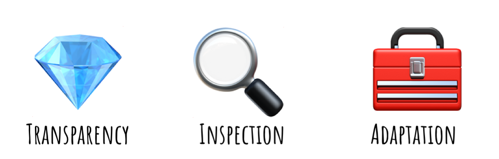

# Scrum Theory
{: .no_toc }

## Table of contents
{: .no_toc .text-delta }

1. TOC
{:toc}

---
## Scrum Theory

Scrum is founded on **empiricism** and **lean thinking**.

- **Empiricism**: asserts that knowledge comes from experience and making decisions based on what is observed.
- **Lean thinking**: Reduces waste and focuses on the essentials.

Scrum employs an iterative, incremental approach to optimise predictability and to control risk. Scrum engages groups of people who collectively have all the skills and expertise to do the work and share or acquire such skills as needed.

Scrum combines four formal events for inspection and adaptation within a containing event, the Sprint. These events work because they implement the empirical Scrum pillars of transparency, inspection, and adaptation.

### Empiricism

There is no such thing as a perfect plan when building a complex product. Detailed plans will almost certainly not work. Scrum Teams still plan, but embrace change and focus on using an empirical approach. Empiricism needs:

- Genuine transparency else all decisions will be based on bad or incomplete information.
- People need to be open and honest about what they have done, what is not done and what problems were encountered along the way.
- Culture to be fostered allowing people to feel they can talk openly without fear of blame.
- One way to think about this is to adopt a mindset of  there is no good or bad news… there is just news.

### 💊 Tough Pill to Sallow

You won’t always be able to provoke the changes that need to be made. But you can always...

**Raise transparency and ensure that decision makers have the information they need to make any necessary changes.**

---

### 💎 Transparency

The emergent process and work must be visible to those performing the work as well as those receiving the work.

With Scrum, important decisions are based on the perceived state of its three formal artifacts. Artifacts that have low transparency can lead to decisions that diminish value and increase risk.

Transparency enables inspection. Inspection without transparency is misleading and wasteful.

☝️Coaching
{: .label }
There can be challenges with transparency, for example,

- [ ] Are the team comfortable working in an Agile way, breaking work down and delivering it in an incremental and iterative way?
- [ ] Do the team regularly update the Product Backlog and Sprint Backlog?
- [ ] Are they able to produce a done, useable, valuable increment every Sprint?
- [ ] Do the team trust one another and are they working towards common goals?
- [ ] Is there a blame culture in the organisation?
- [ ] Are the team trusted, empowered and allowed to (sometimes) fail?
- [ ] Are the team nervous about speaking up in front of senior stakeholders?
- [ ] Is there a fear of conflict?

---

### 🔍 Inspection

The Scrum artifacts and the progress toward agreed goals must be inspected frequently and diligently to detect potentially undesirable variances or problems. To help with inspection, Scrum provides cadence in the form of its five events.

**Inspection enables adaptation**. Inspection without adaptation is considered pointless. Scrum events are designed to provoke change.

---

### 🧰 Adaptation

If any aspects of a process deviate outside acceptable limits or if the resulting product is unacceptable, the process being applied or the materials being produced must be adjusted. The adjustment must be made as soon as possible to minimise further deviation.

**Adaptation becomes more difficult when the people involved are not empowered or self-managing**. A Scrum Team is expected to adapt the moment it learns anything new through inspection.

☝️Coaching
{: .label }
There can be challenges with inspection and adaptation, for example,
Is there an understanding that the plan for a Sprint isn’t set in stone and updating timelines and scope for product delivery is not only normal but also desirable?

- [ ] Does the organisation want to deliver on time and scope or do they want to create the best product they possibly can?
- [ ] Are the team able to change their ways of working?
- [ ] Are stakeholders actively involved and participating in Sprint Reviews?
- [ ] Are the team creating their own estimates or are estimates imposed on them?
- [ ] Are the team trusted to come up with their own solutions?
- [ ] Once a plan has been made, is it difficult to change that plan?
- [ ] Are estimates treated as commitments?

---

[Scrum Values](https://iamjackreed.github.io/psm/docs/understanding-and-applying-scrum/scrum-values/){: .btn-blue}
