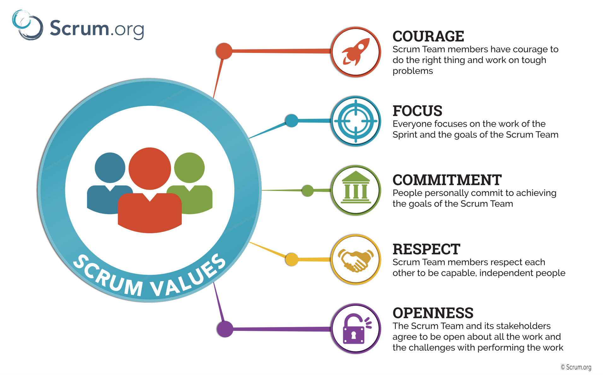

# Scrum Values
{: .no_toc }

## Table of contents
{: .no_toc .text-delta }

1. TOC
{:toc}

---

## Scrum Values

The Scrum Team commits to achieving its goals and to supporting each other. Their primary focus is on the work of the Sprint to make the best possible progress toward these goals. The Scrum Team and its stakeholders are open about the work and the challenges.

Scrum Team members respect each other to be capable, independent people, and are respected as such by the people with whom they work. The Scrum Team members have the courage to do the right thing, to work on tough problems.

These values give direction to the Scrum Team with regard to their work, actions, and behaviour. The decisions that are made, the steps taken, and the way Scrum is used should reinforce these values, not diminish or undermine them. The Scrum Team members learn and explore the values as they work with the Scrum events and artifacts. When these values are embodied by the Scrum Team and the people they work with, the empirical Scrum pillars of transparency, inspection, and adaptation come to life building trust.

Successful use of Scrum depends on people becoming more proficient in living five values:
- **Commitment**
- **Focus**
- **Openness**
- **Respect**
- **Courage**

**Lack of trust impacts all of the above Values.**

These values give direction to the Scrum Team with regard to their work, actions, and behaviour. The decisions that are made, the steps taken, and the way Scrum is used should reinforce these values, not diminish or undermine them.

### 🤝 Commitment

**People personally commit to achieving the goals of the Scrum Team.**

Scrum values **give direction to the work done in Scrum**, along with the work ethics the Scrum Team should.

**Commitment:** The Scrum Team members should personally commit to achieving the Scrum Goals. Commitment is about **dedication and applies to the actions, the effort, not the final results.** The Scrum should:

- Commit to quality, commit to collaborate.
- Commit to learn, commit to do the best they can, every day.
- Commit to the Sprint Goal, commit to professional.
- Commit to self-manage, commit to excellence.
- Commit to the agile principles, commit to create working software.
- Commit to looking for improvement, commit to the Definition of Done.
- Commit to the Scrum framework, commit to focus on value.
- Commit to finish work, commit to inspect & adapt.
- Commit to transparency.

☝️Coaching
{: .label }

Scrum isn’t meant to be easy. It is designed to provoke change and change can push people outside their comfort zones. If you are starting with a new team observe whether they are living and breathing the Scrum Values. For example, when observing a Scrum Team in terms of commitment:

- [ ] Are they committed to the team’s goals or their own personal goals?
- [ ] Are they willing to collaborate and find solutions when things go wrong or do they throw their hands in the air and give up?
- [ ] Are they willing to try something else?
- [ ] Are they willing to volunteer for tasks they don’t particularly enjoy or that aren’t in their core skillset if it’s in the best interests of the team?

### 🎯 Focus

**Everyone focuses on the work of the Sprint and goals of the Scrum team.**

☝️Coaching
{: .label }

- [ ] Are the Scrum Team focussed on the Sprint Goal and able to stay focussed when distractions inevitably arise?

### 🦁 Courage

**Scrum Team members have courage to do the right thing and work on tough problems.**

☝️Coaching
{: .label }

### ❤️ Respect

**Scrum Team members respect each other to be capable, independent people.**

☝️Coaching
{: .label }

### 🚪 Openness

**Scrum Team and its stakeholders agree to be open about the all the work and the challenges with performing the work.**

☝️Coaching
{: .label }
